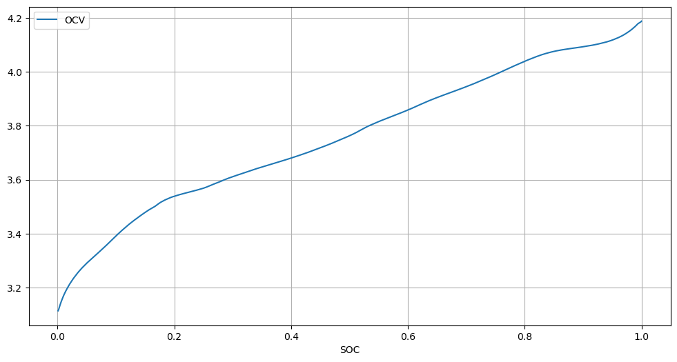
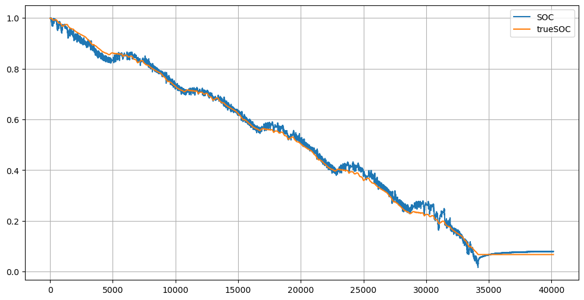
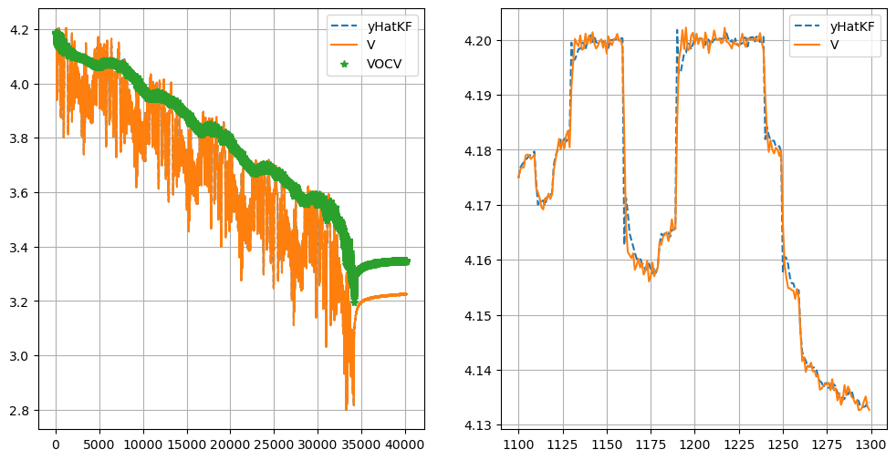
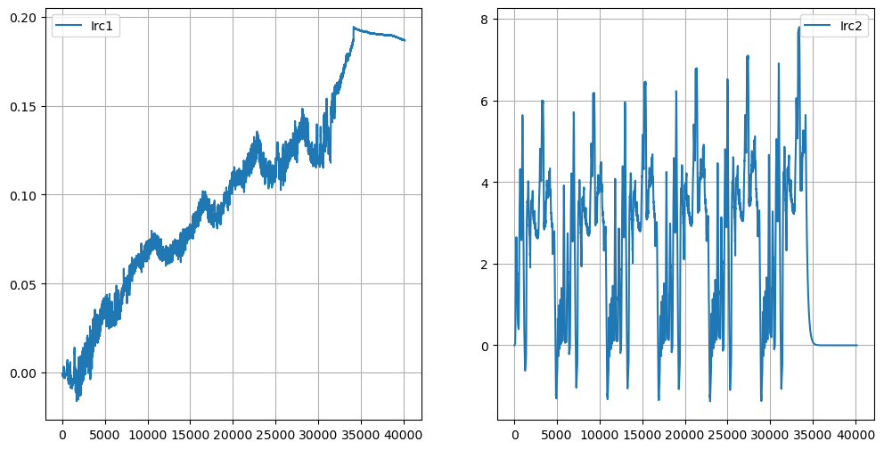
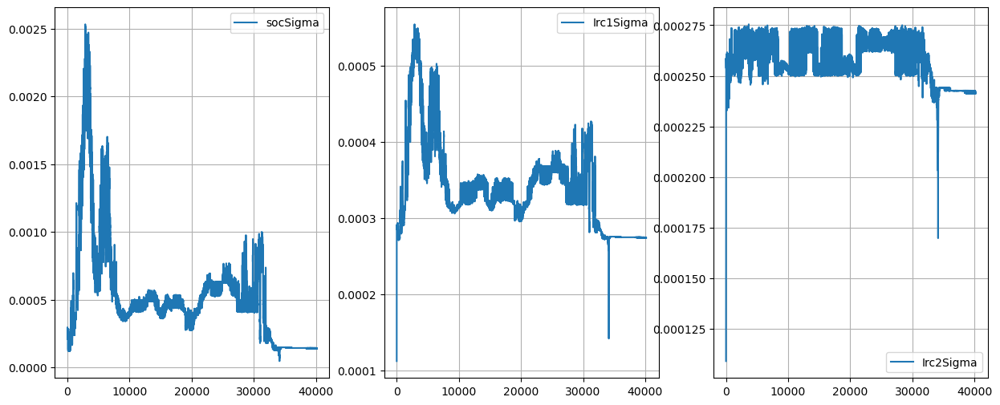
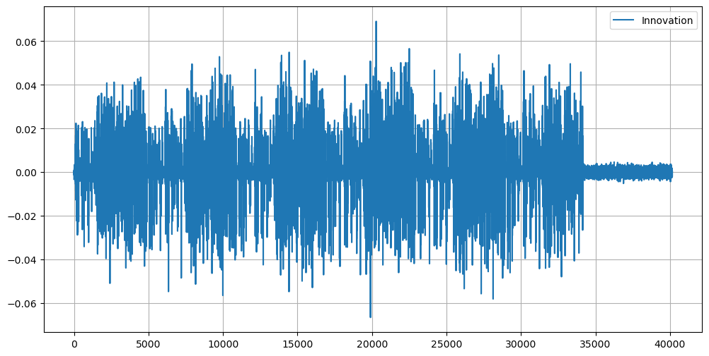

# State of Charge Estimation of Li-ion Batteries using Extended Kalman Filter
- Refer to [EKF.ipynb](EKF.ipynb)

## Open Source Datasets Used
### [LG 18650HG2](https://data.mendeley.com/datasets/cp3473x7xv/3)
- Kollmeyer, Phillip; Vidal, Carlos; Naguib Mina; Skells, Michael  (2020), “LG 18650HG2 Li-ion Battery Data and Example Deep Neural Network xEV SOC Estimator Script”, Mendeley Data, V3, doi: 10.17632/cp3473x7xv.3

## Battery Models Used
### RC2 model:
- 

| r0       | r1       | c1       | r2           | c2          |
|----------|----------|----------|--------------|-------------|
| 0.019414 | 0.656103 | 0.014601 | 82719.773966 | 1360.246886 |

- Some model shortcomings:
    - One cell parameter set is used for the entire SOC range.
    - There is no hysteresis component in this model, thus Irc1 compensates for this.
    - SOC values drift from true values due to the above as well.

## OCV-SOC curve and cell modelling
- Refer to [Data Driven Modelling of Li-ion Batteries](https://github.com/raghuramshankar/data-driven-modelling-of-li-ion-batteries)
- 

## Kalman Filter plots
- 
- 
- 
- 
- 
- 